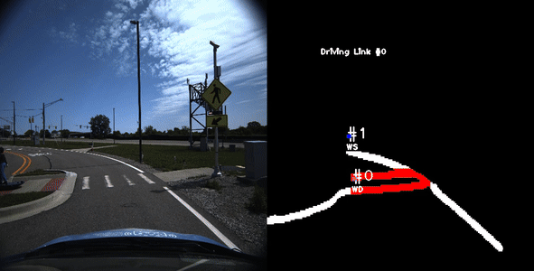
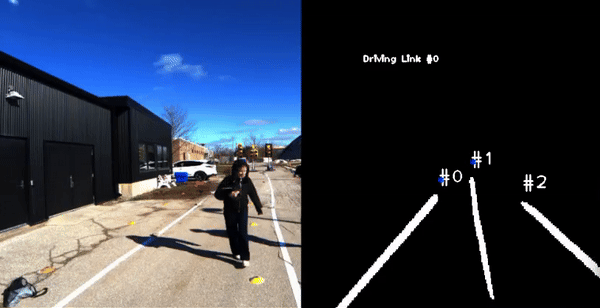

*This document is currently under revision...*

# Perception Team at aUToronto

The University of Toronto's Self-Driving Car Team, [aUToronto](https://www.autodrive.utoronto.ca/), is a student-led design team that competes every year at the GM/SAE AutoDrive Challenge Series. We are tasked with building a level 4 autonomous vehicle that can navigate through numerous static and dynamic challenges in an urban environment created at MCity, Michigan.

#### What is Level 4 Autonomy?

Level 4 autonomy refers to a vehicle's ability to drive itself without human intervention in most situations, but human control is optional in certain conditions.

At aUToronto, we work towards the following tasks:
1. **Autonomous Navigation:** Vehicles must navigate a complex urban environment autonomously, including handling intersections, traffic signals, and roundabouts.
2. **Object Detection and Avoidance:** Cars must detect and avoid pedestrians, other vehicles, and obstacles in real-time.
3. **Parking:** Teams must develop systems for autonomous perpendicular parking.
4. **Path Planning:** Vehicles must create and follow an optimal path, considering dynamic and static objects.
5. **Safety and Reliability:** Ensuring the vehicle operates safely and reliably under various conditions, including inclement weather and different road types.

### My involvement with aUToronto has been as follows:

1. **August 2022 - June 2023:** Lane Detection Team Member
    - Developed post-processing algorithms to distinguish between lane types in the scene such as solid white/yellow lanes, dashed white/yellow lanes, and stop lines
    - Used ROS2 to integrate pos-processing and pass information down the autonomy stack
2. **January 2024 - June 2024:** 3D Object Detection Team Member
    - Worked with PointClouds in ROS2 provided by 3D LiDARs to detect obstacles such as signs, pedestrians, barrels, deer, and cars
    - Found and resolved several bugs in existing methods, improving efficiency and accuracy of the overall 3D object detection pipeline

## Lane Detection

When striving towards building a vehicle with level 4 autonomy, lane detection becomes one of the most crucial and fundamental problems to solve. Simply put, lane detection is an umbrella term for lane line segmentation and classification, which is the process of identifying where exactly the lane lines are in a driving scene and classifying what type of lane it is. 

Lane detection is a heavily studied area of Computer Vision, and as such, there are vasts amounts [research papers](https://paperswithcode.com/task/lane-detection) outlining the different classical and deep learning approaches for it. Here are some examples of different lane detection methodologies:
  - Pass an image into a deep neural network (for example, a Convolutional Neural Network), trained in a supervised fashion to output binary masks of lanes.
  - Classical approach involving a combination of the following:
    - Contour detection (Canny, Sobel, etc.)
    - Line fitting (Hough transform)
    - Clustering (K-means, DBSCAN, etc.)
    - Pixel thresholding in different color spaces (RGB, HSV, YCbCr)
  - Take as an input an RGB image in camera frame but then transform it into the bird's eye view (BEV) plane using camera intrinsics and extrinsics. By doing so, the lane lines are parallel, making it easier to detect lines using classical approaches.

However, converting an image of a driving scene into a binary mask outlining the locations of lane lines, is only one piece of the puzzle. The next step is identifying what kind of lane line it is, so that your vehicle can take appropriate measures when planning a safe path from point A to point B.

### Post-processing: Transforming a segmentation mask of lanes into useful information for autonomy

To extract crucial information about lane lines from a driving scene, I wrote a post-processing script that would take as input a driving scene and a binary segmentation mask of the lane lines (produced by any lane detection method, for example, YOLOPv2) and output the following information:
- lane line type and color:
  - WS: white solid
  - WD: white dashed
  - YS: yellow solid
  - YD: yellow dashed
  - SL: stop line, annotated as red
- lane line number: starting with the leftmost lane in current frame
- current driving link: i.e. which lane the car is currently driving in

The post-processing script can extract this information in real-time (>20 FPS), thereby being a viable solution for lane line classification a level 4 autonomy vehicle, where the vehicle needs to use perception to make quick and precise decisions in a dynamic environment. Once this information is extracted, it is passed downstream through ROS2 messages to other parts of the autonomy stack such as mapping and navigation.

*Post-processing results on MCity (running at 1.5x normal speed)*

*Showcasing the robustness of post-processing in occluded scenes*

## 3D Object Detection

### Railroad bar detection

